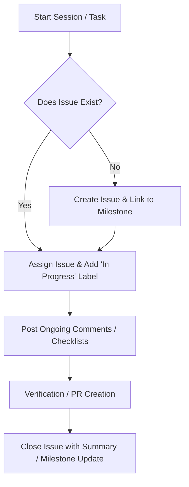

# GitHub Issues & Milestones Management Guide for AI Developer Agents

This guide defines the required process, structure, and discipline for managing GitHub Issues and Milestones in the **Erashra** project. Every AI agent working on this repository must read and adhere to these guidelines at the beginning of each session.

---

## 1. Initial State Check (Every New Chat)
Before writing any code or executing commands, the AI agent **MUST**:
1. Check the GitHub MCP connection.
2. Retrieve the list of active Milestones and their due dates.
3. Retrieve all open issues to understand current priorities.
4. Align the current task with an existing issue or create a new one.

---

## 2. Issue Lifecycle Workflow



### Step 2.1: Prioritization & Linking
*   **Milestone Association**: Every issue must be linked to a current Milestone (e.g., `MVP Release`, `v1.0.0-alpha`).
*   **Assignees**: The issue must be assigned to the current agent or user working on it.
*   **Labels**: Apply clear labels:
    *   `bug` (defects)
    *   `enhancement` (new features/improvements)
    *   `documentation` (docs/guides)
    *   `in-progress` (active development)

### Step 2.2: Issue Template Structure
When creating a new issue, use the following clean format:

```markdown
## 🎯 Goal
[Short description of the goal]

## 📋 Tasks & Scope
- [ ] Sub-task 1
- [ ] Sub-task 2

## 🧪 Verification Plan
- [ ] How this will be tested (automated tests, manual validation)
```

### Step 2.3: Active Development Updates
*   **Start of work**: Add a comment to the issue stating that work is starting: *"Now working on this issue. Current step: [Step Name]."*
*   **Checklist progress**: As tasks are completed, post a comment or edit the issue description to mark tasks as checked (`[x]`).

### Step 2.4: Issue Closure & Completion
Once work is verified:
1. Remove the `in-progress` label.
2. Add a final comment to the issue summarizing the changes, linking relevant files/commits, and showing verification results.
3. Close the issue.
4. Query the associated milestone to verify if all linked issues are closed, and if so, report the milestone completion status.

---

## 3. GitHub MCP Tool Reference
Use the following tools provided by the `github-mcp-server` to perform these actions:
*   **To List/Search**: `list_issues`, `search_issues`, `list_releases`
*   **To Create/Modify**: `create_issue` (or `create_or_update_file` if creating tracking docs), `update_pull_request`
*   **To Interact**: `add_issue_comment`
